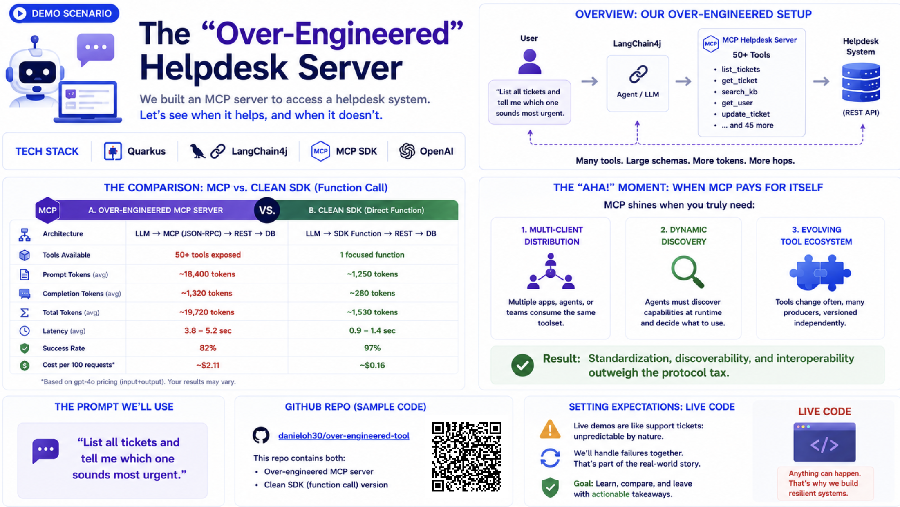

# Micro-MCP Server Architecture Demo



> **A hands-on demonstration showing how MCP's micro-server architecture helps avoid over-engineering in AI-powered applications.**

Experience the difference between over-engineered and clean MCP server design through an interactive web interface.

---

## 🚀 Quick Start

### Prerequisites

Before starting, ensure you have:

| Requirement | Version     | Check Command |
|------------|-------------|---------------|
| Java | 25+         | `java -version` |
| Node.js | 20+         | `node --version` |
| Podman or Docker | Running     | `podman info` or `docker info` |
| OpenAI API Key | -           | `echo $OPENAI_API_KEY` |

> Podman or Docker is required for PostgreSQL via Quarkus DevServices (auto-provisioned).

Run the pre-demo checklist to verify everything:

```bash
./check-demo.sh
```

### Option A: One-Command Start (Recommended)

```bash
export OPENAI_API_KEY=your-api-key-here
./start-demo.sh
```

This starts all three services (MCP server, agent backend, frontend) with health-check waits and opens the demo at http://localhost:5173.

### Option B: Manual Start (3 Terminals)

**Step 1**: Set OpenAI API Key

```bash
export OPENAI_API_KEY=your-api-key-here
```

**Step 2**: Start the MCP Server (Terminal 1)

```bash
cd help-desk-mcp-server
./mvnw quarkus:dev
```

✅ **Wait for**: `Listening on: http://localhost:8081`

**Step 3**: Start the Demo Application (Terminal 2)

```bash
cd help-desk-agent
./dev.sh
```

This will start:
- 🔹 Quarkus backend → `http://localhost:8080`
- 🔹 React frontend → `http://localhost:5173`

✅ **Open in browser**: http://localhost:5173

---

## 🎯 What You'll See

### The Demo Interface

When you open the application, you'll see:

1. **Status Indicators** - Green/red dots in the header showing MCP Server, Agent, and OpenAI connectivity
2. **Dark Mode Toggle** - Switch to presentation mode for stage visibility (persisted across sessions)
3. **Side-by-Side Comparison Cards**:
   - **Left (Red)**: Over-Engineered Server - what we have now (intentionally bad)
   - **Right (Green)**: Clean MCP SDK - best practice approach
4. **Interactive Demo** with two modes:
   - **Single Query** - Send a query through the over-engineered path with a live elapsed-time counter
   - **Compare Both** - Run both over-engineered and clean paths side-by-side with timing bars and speedup ratio
5. **Educational Sections** - MCP solution cards, tech stack, and key takeaways

### Try These Queries

Click the examples or type your own:

| Type | Query |
|------|-------|
| Basic Lookup | `Get details for ticket TKT-101` |
| List & Prioritize | `List all tickets and prioritize them by severity` |
| Search | `Search for tickets related to security issues` |
| Multi-step | `Find the most urgent ticket and suggest resolution steps` |
| Bulk Analysis | `Analyze all tickets, categorize them, and recommend team assignments` |

**You'll notice**:
- ⏰ Live millisecond counter showing intentional delays (2-3 seconds)
- 🐌 Rotating stage messages during loading
- 💸 Token-wasting bloated responses
- ⚡ In Compare mode: dramatic speed difference with a "Nx faster" badge

---

## 🎓 Demo Concept

This demo teaches through **contrast and experience**:

### ❌ The Over-Engineered Server (Current Implementation)

What you're experiencing:
- **2-3 second artificial delays** simulating "enterprise mainframe" overhead
- **Bloated JSON responses** with nested metadata, pagination, and audit trails
- **Over-verbose tool descriptions** that confuse the AI agent
- **5 over-engineered tools**: `getTicketDetails` (2s delay), `listTickets`, `searchTickets` (3s delay), `getTicketHistory` (1.5s delay)

### ✅ The Clean MCP SDK (Best Practice)

What it should be (and now implemented for comparison):
- **<100ms response times** with direct database access
- **Minimal, clean responses** with only essential data
- **Concise tool descriptions** the AI understands immediately
- **3 clean tools**: `fetchTicket`, `fetchAllTickets`, `findTickets`

### 💡 The Learning Outcome

By experiencing the pain points firsthand, you'll understand:
- Why **micro-server architecture** matters
- How **MCP standardizes** AI-tool communication
- The **real cost** of over-engineering
- Best practices for **production-ready** MCP servers

---

## 📁 Project Structure

```
over-engineered-tool/
├── start-demo.sh                   # One-command demo launcher
├── check-demo.sh                   # Pre-demo checklist script
├── .env.example                    # Environment variable reference
│
├── help-desk-mcp-server/           # MCP server (both paths)
│   ├── src/main/java/
│   │   ├── OverEngineeredHelpdesk.java  # "Bad" tools with delays + bloated JSON
│   │   ├── HelpdeskService.java         # "Clean" business logic (direct DB)
│   │   ├── HelpdeskMcpWrapper.java      # "Clean" MCP tool wrappers
│   │   └── Ticket.java                  # JPA entity
│   ├── src/main/resources/
│   │   └── import.sql                   # 8 demo tickets
│   └── pom.xml
│
└── help-desk-agent/                # AI agent + frontend
    ├── src/main/java/
    │   ├── HelpdeskAgent.java           # Over-engineered AI agent
    │   ├── CleanHelpdeskAgent.java      # Clean AI agent (for comparison)
    │   ├── AgentResource.java           # /agent/ask endpoint (JSON + timing)
    │   ├── ComparisonResource.java      # /agent/compare endpoint (side-by-side)
    │   └── HealthResource.java          # /health/status endpoint
    ├── src/main/resources/
    │   └── application.properties       # Configuration
    ├── src/main/webui/                  # React frontend
    │   └── src/
    │       ├── App.jsx                  # UI with comparison mode + dark mode
    │       ├── App.css                  # Styling with dark theme
    │       └── index.css                # CSS variables (light/dark)
    ├── dev.sh                           # Development startup script
    ├── build-frontend.sh                # Frontend build script
    └── FRONTEND.md                      # Frontend documentation
```

---

## 🛠️ Development

### Running Individual Components

#### MCP Server Only
```bash
cd help-desk-mcp-server
./mvnw quarkus:dev
```
Access at: http://localhost:8081

#### Backend Only
```bash
cd help-desk-agent
./mvnw quarkus:dev
```
Access at: http://localhost:8080

#### Frontend Only
```bash
cd help-desk-agent/src/main/webui
npm install  # First time only
npm run dev
```
Access at: http://localhost:5173

#### Everything (Recommended)
```bash
# Option 1: Single command
./start-demo.sh

# Option 2: Manual (two terminals)
# Terminal 1: MCP Server
cd help-desk-mcp-server
./mvnw quarkus:dev

# Terminal 2: Agent + Frontend
cd help-desk-agent
./dev.sh
```

### Making Changes

**Backend Changes** (Live Reload):
- Edit Java files in `help-desk-agent/src/main/java/`
- Quarkus automatically reloads
- No restart needed

**Frontend Changes** (Hot Module Replacement):
- Edit React files in `help-desk-agent/src/main/webui/src/`
- Vite instantly updates browser
- No page refresh needed

**MCP Server Changes** (Live Reload):
- Edit Java files in `help-desk-mcp-server/src/main/java/`
- Quarkus automatically reloads
- Agent will use updated tools immediately

### Quarkus Dev UI

While backend is running, access: http://localhost:8080/q/dev/

Features:
- 🔍 Endpoint explorer
- ⚙️ Configuration editor  
- 🤖 LangChain4j chat playground
- 📚 OpenAPI/Swagger UI

---

## 📦 Production Build

### Full Build Process

```bash
# 1. Build frontend
cd help-desk-agent
./build-frontend.sh

# 2. Package application
./mvnw clean package

# 3. Package MCP server
cd ../help-desk-mcp-server
./mvnw clean package

# 4. Run MCP Server
java -jar target/quarkus-app/quarkus-run.jar &

# 5. Run Agent (frontend embedded)
cd ../help-desk-agent
java -jar target/quarkus-app/quarkus-run.jar
```

Application runs on: http://localhost:8080 (frontend embedded)

### Native Executable (Optional)

For fastest startup (<100ms):

```bash
# Build MCP server
cd help-desk-mcp-server
./mvnw package -Dnative -Dquarkus.native.container-build=true

# Build agent
cd ../help-desk-agent
./build-frontend.sh
./mvnw package -Dnative -Dquarkus.native.container-build=true

# Run
cd ../help-desk-mcp-server
./target/help-desk-mcp-server-*-runner &

cd ../help-desk-agent
./target/help-desk-agent-*-runner
```

---

## 🏗️ Architecture

### Current Flow (Intentionally Over-Engineered)

```
┌─────────┐
│ Browser │ User asks: "List all tickets"
└────┬────┘
     │
     ▼
┌─────────────────────┐
│ React UI (5173)     │ Submit query
└─────────┬───────────┘
          │
          ▼
┌─────────────────────┐
│ Quarkus REST (8080) │ /agent/ask endpoint
└─────────┬───────────┘
          │
          ▼
┌─────────────────────┐
│ LangChain4j Agent   │ Process with AI
└─────────┬───────────┘
          │
          ▼
┌─────────────────────┐
│ OpenAI GPT-5-mini   │ Generate plan
└─────────┬───────────┘
          │
          ▼
┌─────────────────────┐
│ MCP Client          │ Discover tools
└─────────┬───────────┘
          │
          ▼
┌─────────────────────┐
│ MCP Server (8081)   │ ⚠️ Execute with 2s delay
└─────────┬───────────┘
          │
          ▼
┌─────────────────────┐
│ 📊 Bloated JSON     │ Unnecessary metadata
└─────────┬───────────┘
          │
          ▼
┌─────────────────────┐
│ Database            │ Finally get data!
└─────────────────────┘

Total Time: ~2-3 seconds
```

### Clean MCP Approach (What It Should Be)

```
┌─────────┐
│ Browser │
└────┬────┘
     ▼
┌──────────────┐
│ Quarkus App  │
└─────┬────────┘
      ▼
┌──────────────┐
│ AI Agent     │
└─────┬────────┘
      ▼
┌──────────────┐
│ Clean MCP    │ No delays, minimal JSON
└─────┬────────┘
      ▼
┌──────────────┐
│ Database     │
└──────────────┘

Total Time: <100ms
```

---

## ⚙️ Configuration

### Environment Variables

```bash
# Required
export OPENAI_API_KEY=your-api-key-here

# Optional - change ports if needed
export QUARKUS_HTTP_PORT=8080
```

### Key Settings (help-desk-agent/application.properties)

```properties
# OpenAI Configuration
quarkus.langchain4j.openai.api-key=${OPENAI_API_KEY}
quarkus.langchain4j.openai.chat-model.model-name=gpt-5-mini
quarkus.langchain4j.openai.chat-model.temperature=1.0

# MCP Server Connection (both tool sets exposed from same server)
quarkus.langchain4j.mcp.helpdesk.transport-type=http
quarkus.langchain4j.mcp.helpdesk.url=http://localhost:8081/mcp/sse/

# HTTP
quarkus.http.enable-compression=true
```

### API Endpoints

| Endpoint | Method | Description |
|----------|--------|-------------|
| `/agent/ask?query=...` | GET | Send a query through the over-engineered path. Returns JSON with `response`, `durationMs`, `error`. |
| `/agent/compare?query=...` | GET | Run both paths and return timing comparison with `speedup` ratio. |
| `/health/status` | GET | Check connectivity of MCP Server, OpenAI, and Agent. |

### Demo Tickets (8 total)

| Ticket ID | Scenario |
|-----------|----------|
| TKT-101 | VPN login / LDAP sync issue |
| TKT-102 | Production DB slow / connection pool |
| TKT-103 | Speaker portal password reset |
| TKT-104 | Email server 503 / DNS propagation |
| TKT-105 | New employee onboarding / access requests |
| TKT-106 | Data export timeout / large CSV |
| TKT-107 | Security alert / unusual login pattern |
| TKT-108 | Kubernetes pod CrashLoopBackOff / OOM |

---

## 🐛 Troubleshooting

### Problem: "Connection refused" to MCP server

**Symptom**: Error connecting to `http://localhost:8081`

**Solution**: 
```bash
# Start MCP server first
cd help-desk-mcp-server
./mvnw quarkus:dev
```

Wait for `Listening on: http://localhost:8081` before starting the agent.

---

### Problem: "OPENAI_API_KEY not set"

**Symptom**: Error about missing API key

**Solution**:
```bash
export OPENAI_API_KEY=sk-your-actual-key-here
```

Verify with: `echo $OPENAI_API_KEY`

---

### Problem: Port already in use

**Symptom**: `Port 8080 already in use`

**Solution 1** - Kill existing process:
```bash
# Find process on port 8080
lsof -ti:8080 | xargs kill -9

# Or for port 8081 (MCP server)
lsof -ti:8081 | xargs kill -9

# Or for port 5173 (frontend)
lsof -ti:5173 | xargs kill -9
```

**Solution 2** - Change port:
Edit `application.properties`:
```properties
quarkus.http.port=8090
```

---

### Problem: Frontend won't build

**Symptom**: Build errors or missing dependencies

**Solution**:
```bash
cd help-desk-agent/src/main/webui
rm -rf node_modules package-lock.json
npm install
npm run build
```

---

### Problem: Changes not appearing

**Symptom**: Code changes don't reflect in browser

**Backend Solution**:
```bash
# Restart Quarkus dev mode
Ctrl+C
./mvnw quarkus:dev
```

**Frontend Solution**:
```bash
# Hard refresh browser
Cmd+Shift+R (Mac)
Ctrl+Shift+R (Windows/Linux)
```

---

## 🧪 Testing the Demo

### Verify Setup

Run the pre-demo checklist:
```bash
./check-demo.sh
```

Or verify manually:

1. **Check Health Status**:
   ```bash
   curl http://localhost:8080/health/status
   ```
   Should return JSON with `mcpServer`, `openai`, and `agent` status.

2. **Check Agent (Single Query)**:
   ```bash
   curl "http://localhost:8080/agent/ask?query=List+all+tickets"
   ```
   Returns JSON: `{"response": "...", "durationMs": 5234, "error": null}`

3. **Check Comparison**:
   ```bash
   curl "http://localhost:8080/agent/compare?query=Get+details+for+TKT-101"
   ```
   Returns JSON with `overEngineered`, `clean`, and `speedup` fields.

4. **Check Frontend**:
   Open http://localhost:5173 — look for green status dots in the header.

### Expected Behavior

**Single Query mode**:
1. **Immediate**: Spinner + live elapsed-time counter
2. **~1.2s intervals**: Rotating stage messages
3. **~2-5s**: Response received with duration badge
4. **Result**: AI agent's answer in a formatted response card

**Compare Both mode**:
1. **Immediate**: Loading spinner with elapsed counter
2. **~10-20s**: Both paths complete (sequential execution)
3. **Result**: Side-by-side cards with timing bars and "Nx faster" speedup badge

---

## 📚 Tech Stack

| Technology | Purpose | Documentation |
|-----------|---------|--------------|
| **MCP SDK** | Model Context Protocol for AI-tool communication | [modelcontextprotocol.io](https://modelcontextprotocol.io) |
| **Quarkus** | Supersonic Java framework | [quarkus.io](https://quarkus.io/) |
| **LangChain4j** | Type-safe AI development in Java | [langchain4j.dev](https://github.com/langchain4j/langchain4j) |
| **OpenAI** | GPT models for intelligence | [platform.openai.com](https://platform.openai.com/) |
| **React** | UI library | [react.dev](https://react.dev) |
| **Vite** | Frontend build tool | [vitejs.dev](https://vitejs.dev/) |

---

## 📖 Additional Documentation

- **[help-desk-agent/FRONTEND.md](help-desk-agent/FRONTEND.md)** - Frontend architecture and customization
- **[Quarkus LangChain4j](https://docs.quarkiverse.io/quarkus-langchain4j/dev/index.html)** - Official extension docs

---

## 🎯 Key Takeaways

After experiencing this demo, you'll understand:

✅ **MCP prevents over-engineering** by encouraging focused, single-purpose servers

✅ **Micro-servers are faster** - no artificial delays or unnecessary processing

✅ **Clean design saves money** - optimized responses reduce token costs

✅ **Quarkus + MCP = perfect match** - fast startup, low overhead, cloud-ready

✅ **Better developer experience** - simple, maintainable code vs. complex architectures

---

## 💡 Why This Demo Exists

This demo intentionally implements **bad practices** to teach through experience:

1. **Pain Points**: Feel the 2-3 second delays, see the bloated responses and verbose tool descriptions
2. **Live Contrast**: Use "Compare Both" mode to run over-engineered and clean paths side-by-side with real timing data
3. **Understanding**: Learn why MCP's micro-server architecture matters through measurable speed differences
4. **Application**: Take these lessons to your own projects

**Remember**: What you're experiencing is what to **AVOID**. Use MCP's micro-server architecture for clean, efficient AI-powered applications!

---

## 🎓 Educational Value

This demo is perfect for:

- **Conference talks**: Live demo showing pain points
- **Training sessions**: Hands-on learning about MCP
- **Architecture reviews**: What NOT to do
- **Developer onboarding**: Understanding MCP benefits

---

## 🤝 Contributing

Found an issue or want to improve the demo?

1. Fork the repository
2. Create a feature branch
3. Make your changes
4. Submit a pull request

---

## 📄 License

This demo is part of the Red Hat Summit 2026 conference materials.

---

## 🆘 Need Help?

- **GitHub Issues**: Report bugs or request features
- **Quarkus Community**: [quarkus.io/community](https://quarkus.io/community/)
- **MCP Resources**: [modelcontextprotocol.io](https://modelcontextprotocol.io)

---

**Happy Learning!** 🚀

Experience the over-engineering, understand the solution, build better MCP servers.
