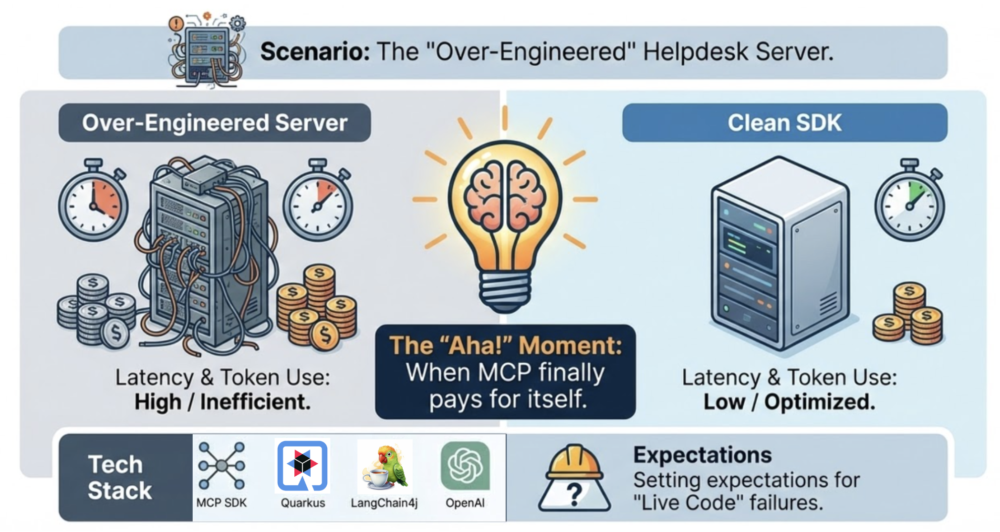

# Micro-MCP Server Architecture Demo



> **A hands-on demonstration showing how MCP's micro-server architecture helps avoid over-engineering in AI-powered applications.**

Experience the difference between over-engineered and clean MCP server design through an interactive web interface.

---

## 🚀 Quick Start (3 Steps)

### Prerequisites

Before starting, ensure you have:

| Requirement | Version | Check Command |
|------------|---------|---------------|
| Java | 17+ (25 recommended) | `java -version` |
| Node.js | 20+ | `node --version` |
| OpenAI API Key | - | `echo $OPENAI_API_KEY` |

### Step 1: Set OpenAI API Key

```bash
export OPENAI_API_KEY=your-api-key-here
```

### Step 2: Start the MCP Server

Open a **new terminal window** and run:

```bash
cd help-desk-mcp-server
./mvnw quarkus:dev
```

✅ **Wait for**: `Listening on: http://localhost:8081`

> ⚠️ **Note**: This MCP server is intentionally over-engineered with 2-second delays to demonstrate bad practices.

### Step 3: Start the Demo Application

In your **original terminal**, run:

```bash
cd help-desk-agent
./dev.sh
```

This will start:
- 🔹 Quarkus backend → `http://localhost:8080`
- 🔹 React frontend → `http://localhost:5173`

✅ **Open in browser**: http://localhost:5173

---

## 🎯 What You'll See

### The Demo Interface

When you open the application, you'll see:

1. **"Aha!" Moment Banner** - Understanding when MCP architecture pays off
2. **Side-by-Side Comparison**:
   - **Left (Red)**: Over-Engineered Server - what we have now (intentionally bad)
   - **Right (Green)**: Clean MCP SDK - best practice approach
3. **Interactive Demo** - Try queries and experience the 2-second delay
4. **Educational Sections** - Learn MCP benefits and best practices

### Try These Queries

Click the examples or type your own:

```
"List all tickets and tell me which one sounds most urgent"
"Get details for ticket TKT-101"
"What tickets are available?"
"Analyze all tickets and prioritize them by severity"
```

**You'll notice**:
- ⏰ Intentional 2-second delay
- 🐌 Slow loading stages
- 💸 Token-wasting bloated responses

---

## 🎓 Demo Concept

This demo teaches through **contrast and experience**:

### ❌ The Over-Engineered Server (Current Implementation)

What you're experiencing:
- **2-second artificial delays** simulating "enterprise mainframe"
- **Bloated JSON responses** with unnecessary metadata
- **High latency** and token waste
- **Poor UX** and higher costs

### ✅ The Clean MCP SDK (Best Practice)

What it should be:
- **<100ms response times** with optimized queries
- **Minimal JSON** with only essential data
- **Low latency** and efficient token usage
- **Better UX** and lower costs

### 💡 The Learning Outcome

By experiencing the pain points firsthand, you'll understand:
- Why **micro-server architecture** matters
- How **MCP standardizes** AI-tool communication
- The **real cost** of over-engineering
- Best practices for **production-ready** MCP servers

---

## 📁 Project Structure

```
over-engineered-tool/
├── help-desk-mcp-server/           # MCP server (intentionally over-engineered)
│   ├── src/main/java/
│   │   ├── OverEngineeredHelpdesk.java  # MCP tools with 2s delay
│   │   ├── Ticket.java                  # JPA entity
│   │   └── HelpdeskService.java         # Business logic
│   └── pom.xml
│
└── help-desk-agent/                # AI agent + frontend
    ├── src/
    │   ├── main/
    │   │   ├── java/
    │   │   │   ├── HelpdeskAgent.java      # AI agent with MCP tools
    │   │   │   └── AgentResource.java      # REST endpoint
    │   │   ├── resources/
    │   │   │   └── application.properties  # Configuration
    │   │   └── webui/                      # React frontend
    │   │       ├── src/
    │   │       │   ├── App.jsx            # Main UI component
    │   │       │   ├── App.css            # Styling
    │   │       │   └── main.jsx           # Entry point
    │   │       ├── package.json
    │   │       └── vite.config.js         # Vite configuration
    ├── dev.sh                              # Development startup script
    ├── build-frontend.sh                   # Frontend build script
    ├── pom.xml                             # Maven configuration
    └── FRONTEND.md                         # Frontend documentation
```

---

## 🛠️ Development

### Running Individual Components

#### MCP Server Only
```bash
cd help-desk-mcp-server
./mvnw quarkus:dev
```
Access at: http://localhost:8081

#### Backend Only
```bash
cd help-desk-agent
./mvnw quarkus:dev
```
Access at: http://localhost:8080

#### Frontend Only
```bash
cd help-desk-agent/src/main/webui
npm install  # First time only
npm run dev
```
Access at: http://localhost:5173

#### Everything (Recommended)
```bash
# Terminal 1: MCP Server
cd help-desk-mcp-server
./mvnw quarkus:dev

# Terminal 2: Agent + Frontend
cd help-desk-agent
./dev.sh
```

### Making Changes

**Backend Changes** (Live Reload):
- Edit Java files in `help-desk-agent/src/main/java/`
- Quarkus automatically reloads
- No restart needed

**Frontend Changes** (Hot Module Replacement):
- Edit React files in `help-desk-agent/src/main/webui/src/`
- Vite instantly updates browser
- No page refresh needed

**MCP Server Changes** (Live Reload):
- Edit Java files in `help-desk-mcp-server/src/main/java/`
- Quarkus automatically reloads
- Agent will use updated tools immediately

### Quarkus Dev UI

While backend is running, access: http://localhost:8080/q/dev/

Features:
- 🔍 Endpoint explorer
- ⚙️ Configuration editor  
- 🤖 LangChain4j chat playground
- 📚 OpenAPI/Swagger UI

---

## 📦 Production Build

### Full Build Process

```bash
# 1. Build frontend
cd help-desk-agent
./build-frontend.sh

# 2. Package application
./mvnw clean package

# 3. Package MCP server
cd ../help-desk-mcp-server
./mvnw clean package

# 4. Run MCP Server
java -jar target/quarkus-app/quarkus-run.jar &

# 5. Run Agent (frontend embedded)
cd ../help-desk-agent
java -jar target/quarkus-app/quarkus-run.jar
```

Application runs on: http://localhost:8080 (frontend embedded)

### Native Executable (Optional)

For fastest startup (<100ms):

```bash
# Build MCP server
cd help-desk-mcp-server
./mvnw package -Dnative -Dquarkus.native.container-build=true

# Build agent
cd ../help-desk-agent
./build-frontend.sh
./mvnw package -Dnative -Dquarkus.native.container-build=true

# Run
cd ../help-desk-mcp-server
./target/help-desk-mcp-server-*-runner &

cd ../help-desk-agent
./target/help-desk-agent-*-runner
```

---

## 🏗️ Architecture

### Current Flow (Intentionally Over-Engineered)

```
┌─────────┐
│ Browser │ User asks: "List all tickets"
└────┬────┘
     │
     ▼
┌─────────────────────┐
│ React UI (5173)     │ Submit query
└─────────┬───────────┘
          │
          ▼
┌─────────────────────┐
│ Quarkus REST (8080) │ /agent/ask endpoint
└─────────┬───────────┘
          │
          ▼
┌─────────────────────┐
│ LangChain4j Agent   │ Process with AI
└─────────┬───────────┘
          │
          ▼
┌─────────────────────┐
│ OpenAI GPT-5-mini   │ Generate plan
└─────────┬───────────┘
          │
          ▼
┌─────────────────────┐
│ MCP Client          │ Discover tools
└─────────┬───────────┘
          │
          ▼
┌─────────────────────┐
│ MCP Server (8081)   │ ⚠️ Execute with 2s delay
└─────────┬───────────┘
          │
          ▼
┌─────────────────────┐
│ 📊 Bloated JSON     │ Unnecessary metadata
└─────────┬───────────┘
          │
          ▼
┌─────────────────────┐
│ Database            │ Finally get data!
└─────────────────────┘

Total Time: ~2-3 seconds
```

### Clean MCP Approach (What It Should Be)

```
┌─────────┐
│ Browser │
└────┬────┘
     ▼
┌──────────────┐
│ Quarkus App  │
└─────┬────────┘
      ▼
┌──────────────┐
│ AI Agent     │
└─────┬────────┘
      ▼
┌──────────────┐
│ Clean MCP    │ No delays, minimal JSON
└─────┬────────┘
      ▼
┌──────────────┐
│ Database     │
└──────────────┘

Total Time: <100ms
```

---

## ⚙️ Configuration

### Environment Variables

```bash
# Required
export OPENAI_API_KEY=your-api-key-here

# Optional - change ports if needed
export QUARKUS_HTTP_PORT=8080
```

### Key Settings (help-desk-agent/application.properties)

```properties
# OpenAI Configuration
quarkus.langchain4j.openai.api-key=${OPENAI_API_KEY}
quarkus.langchain4j.openai.chat-model.model-name=gpt-5-mini
quarkus.langchain4j.openai.chat-model.temperature=1.0

# MCP Server Connection (intentionally over-engineered)
quarkus.langchain4j.mcp.helpdesk.transport-type=http
quarkus.langchain4j.mcp.helpdesk.url=http://localhost:8081/mcp/sse/

# HTTP
quarkus.http.enable-compression=true
```

---

## 🐛 Troubleshooting

### Problem: "Connection refused" to MCP server

**Symptom**: Error connecting to `http://localhost:8081`

**Solution**: 
```bash
# Start MCP server first
cd help-desk-mcp-server
./mvnw quarkus:dev
```

Wait for `Listening on: http://localhost:8081` before starting the agent.

---

### Problem: "OPENAI_API_KEY not set"

**Symptom**: Error about missing API key

**Solution**:
```bash
export OPENAI_API_KEY=sk-your-actual-key-here
```

Verify with: `echo $OPENAI_API_KEY`

---

### Problem: Port already in use

**Symptom**: `Port 8080 already in use`

**Solution 1** - Kill existing process:
```bash
# Find process on port 8080
lsof -ti:8080 | xargs kill -9

# Or for port 8081 (MCP server)
lsof -ti:8081 | xargs kill -9

# Or for port 5173 (frontend)
lsof -ti:5173 | xargs kill -9
```

**Solution 2** - Change port:
Edit `application.properties`:
```properties
quarkus.http.port=8090
```

---

### Problem: Frontend won't build

**Symptom**: Build errors or missing dependencies

**Solution**:
```bash
cd help-desk-agent/src/main/webui
rm -rf node_modules package-lock.json
npm install
npm run build
```

---

### Problem: Changes not appearing

**Symptom**: Code changes don't reflect in browser

**Backend Solution**:
```bash
# Restart Quarkus dev mode
Ctrl+C
./mvnw quarkus:dev
```

**Frontend Solution**:
```bash
# Hard refresh browser
Cmd+Shift+R (Mac)
Ctrl+Shift+R (Windows/Linux)
```

---

## 🧪 Testing the Demo

### Verify Setup

1. **Check MCP Server**:
   ```bash
   curl http://localhost:8081/health
   ```
   Should return: `OK` or health status

2. **Check Quarkus Backend**:
   ```bash
   curl "http://localhost:8080/agent/ask?query=test"
   ```
   Should return a response (with ~2s delay)

3. **Check Frontend**:
   Open http://localhost:5173 in browser

### Expected Behavior

When you submit a query:
1. **Immediate**: Loading spinner appears
2. **~0.5s**: Loading message changes
3. **~2s**: Response received (due to intentional MCP server delay)
4. **Result**: AI agent's answer displayed

---

## 📚 Tech Stack

| Technology | Purpose | Documentation |
|-----------|---------|--------------|
| **MCP SDK** | Model Context Protocol for AI-tool communication | [modelcontextprotocol.io](https://modelcontextprotocol.io) |
| **Quarkus** | Supersonic Java framework | [quarkus.io](https://quarkus.io/) |
| **LangChain4j** | Type-safe AI development in Java | [langchain4j.dev](https://github.com/langchain4j/langchain4j) |
| **OpenAI** | GPT models for intelligence | [platform.openai.com](https://platform.openai.com/) |
| **React** | UI library | [react.dev](https://react.dev) |
| **Vite** | Frontend build tool | [vitejs.dev](https://vitejs.dev/) |

---

## 📖 Additional Documentation

- **[help-desk-agent/FRONTEND.md](help-desk-agent/FRONTEND.md)** - Frontend architecture and customization
- **[Quarkus LangChain4j](https://docs.quarkiverse.io/quarkus-langchain4j/dev/index.html)** - Official extension docs

---

## 🎯 Key Takeaways

After experiencing this demo, you'll understand:

✅ **MCP prevents over-engineering** by encouraging focused, single-purpose servers

✅ **Micro-servers are faster** - no artificial delays or unnecessary processing

✅ **Clean design saves money** - optimized responses reduce token costs

✅ **Quarkus + MCP = perfect match** - fast startup, low overhead, cloud-ready

✅ **Better developer experience** - simple, maintainable code vs. complex architectures

---

## 💡 Why This Demo Exists

This demo intentionally implements **bad practices** to teach through experience:

1. **Pain Points**: Feel the 2-second delay, see the bloated responses
2. **Contrast**: Compare bad vs. good side-by-side
3. **Understanding**: Learn why MCP's micro-server architecture matters
4. **Application**: Take these lessons to your own projects

**Remember**: What you're experiencing is what to **AVOID**. Use MCP's micro-server architecture for clean, efficient AI-powered applications!

---

## 🎓 Educational Value

This demo is perfect for:

- **Conference talks**: Live demo showing pain points
- **Training sessions**: Hands-on learning about MCP
- **Architecture reviews**: What NOT to do
- **Developer onboarding**: Understanding MCP benefits

---

## 🤝 Contributing

Found an issue or want to improve the demo?

1. Fork the repository
2. Create a feature branch
3. Make your changes
4. Submit a pull request

---

## 📄 License

This demo is part of the Red Hat Summit 2026 conference materials.

---

## 🆘 Need Help?

- **GitHub Issues**: Report bugs or request features
- **Quarkus Community**: [quarkus.io/community](https://quarkus.io/community/)
- **MCP Resources**: [modelcontextprotocol.io](https://modelcontextprotocol.io)

---

**Happy Learning!** 🚀

Experience the over-engineering, understand the solution, build better MCP servers.
